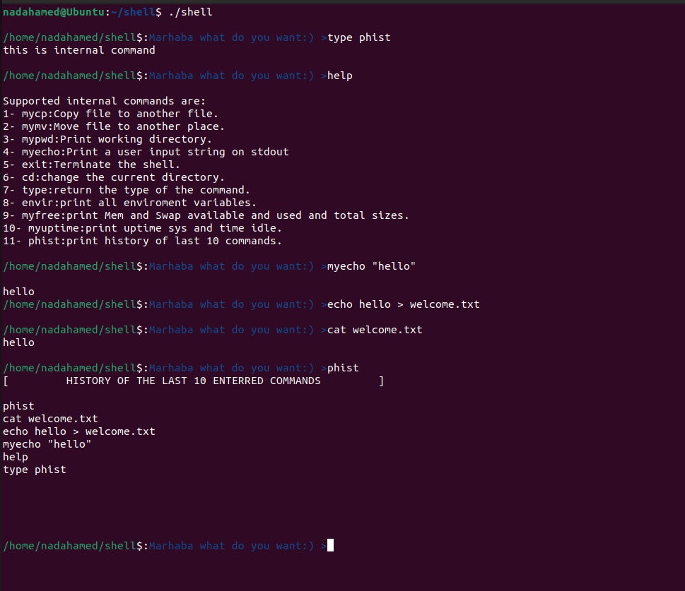
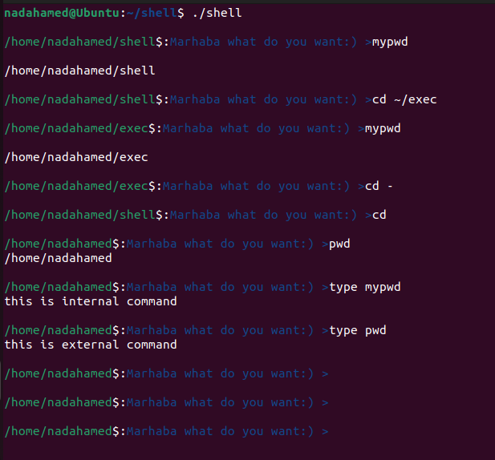

# Shell Project

This project implements a custom shell that supports a variety of built-in and external commands. It provides functionality for executing commands, managing directories, and handling environment variables.

## Files

- `main.c`: Contains the main function which checks the input command and calls the appropriate function from `commands.c`.
- `commands.c`: Contains the implementation of the functions used to run commands.
- `commands.h`: Header file declaring the functions defined in `commands.c`.

## Features

### Built-in Commands

- `mycp`: Copy files or directories (replaces `cp`).
- `mymv`: Move or rename files or directories (replaces `mv`).
- `mypwd`: Print the current working directory (replaces `pwd`).
- `myecho`: Echo text to the standard output (replaces `echo`).
- `help`: Display help information.
- `exit`: Exit the shell.
- `cd path`: Change the current directory.
- `type command`: Return the type of the command (`internal`, `external`, or `unsupported`).
- `envir`: Print all environment variables (same as `env`).
- `phist`: Print the history of the last 10 commands.
- `myfree`: Print RAM info (total size, used, and free) and Swap area info (total size, used, free).
- `myuptime`: Print the uptime for the system and the time spent in the idle process.

### External Commands

- Execute programs using their names directly (without needing to specify the full path).
- Commands are executed with dynamically allocated argument lists, ensuring flexibility and no memory leaks.
- Proper memory management is implemented to handle allocated resources efficiently.
- Redirection to input,output,error and append is also supported. You can try:
    ```sh
  echo hello world > welcome.txt
    cat < welcome.txt
- Pipe feature is also supported. You can try:
  ```sh
  pstree | less
  
## Example Output

Here is an example of the shell output:








## Video Illustration

To get a visual demonstration of the shell in action and used gdbscript, you can watch the following video:

[Watch the Shell Demonstration](https://drive.google.com/file/d/1D2u0lb4sz1OLAr5F_jVc0alyda5k24-t/view?usp=sharing)


## Building and Running

To build the shell, use the following command:

```sh
gcc -o shell main.c commands.c
  
